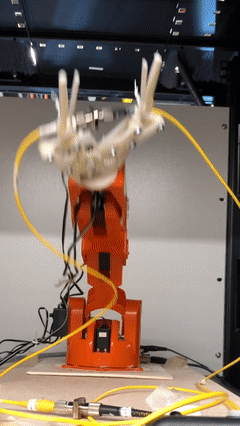
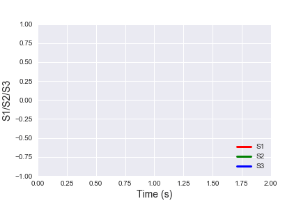
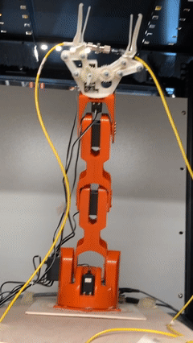
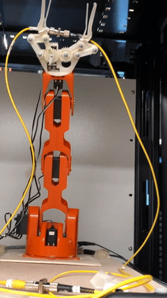
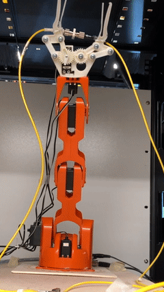
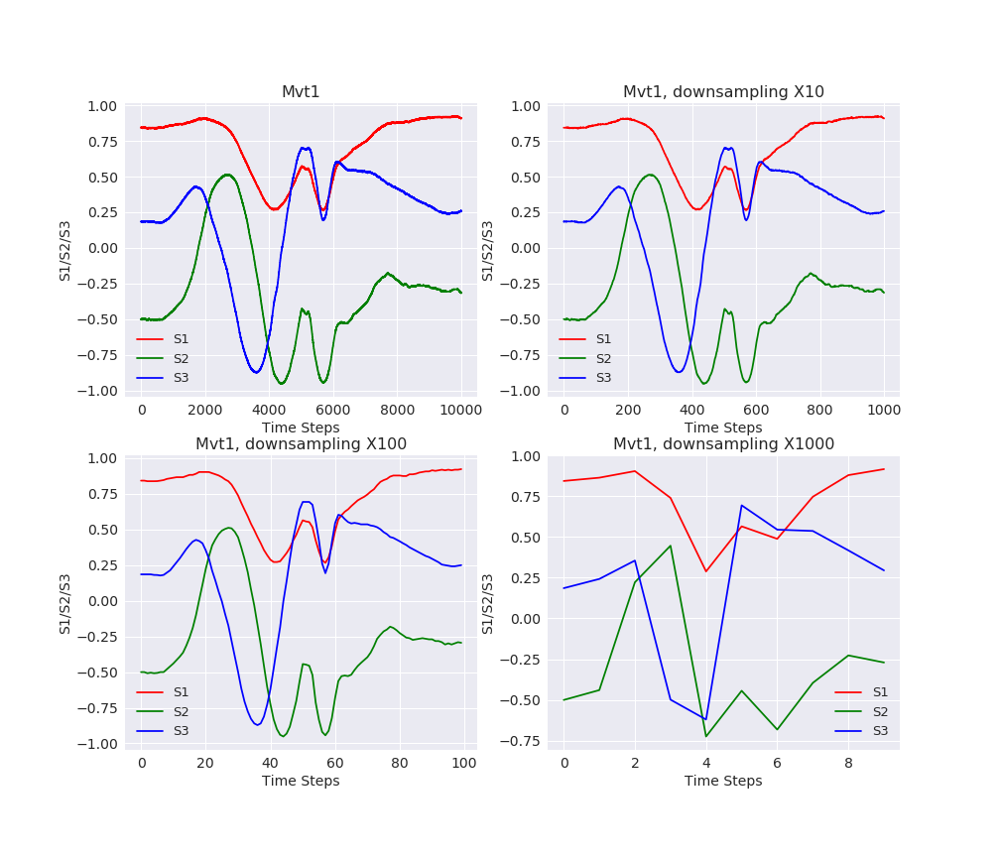
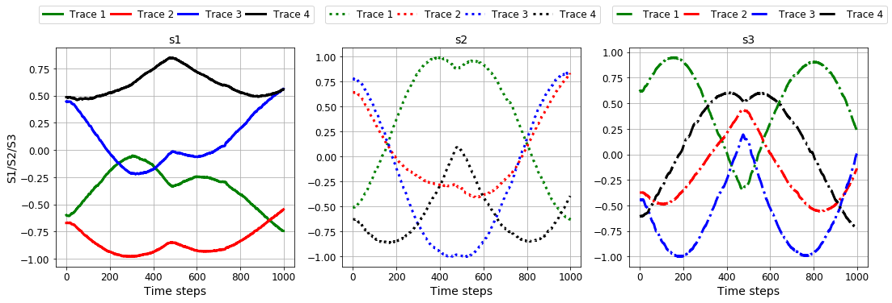
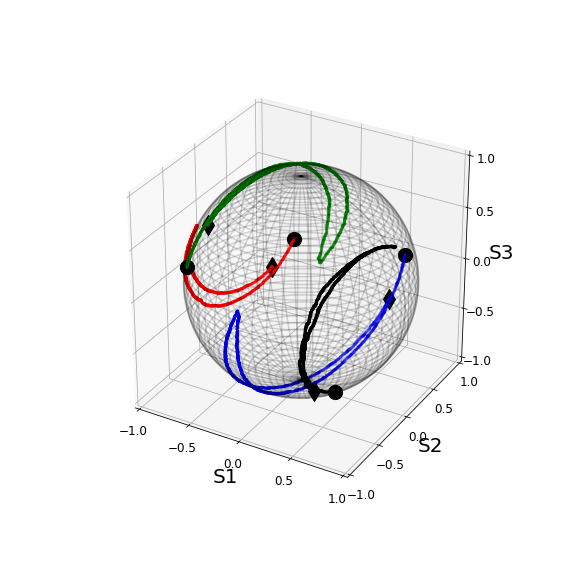

## Introduction

Fiber cut due to construction activities (e.g. digging) is one of the main causes of network outage in metropolitan area. Thus, predicting imminent fiber cuts and rerouting traffic accordingly are crucial in maintain network reliability. 

For this project, we focus on using machine learning (ML) to build such an “early warning” system, by using state-of-polarization (SOP) signatures associated with different mechanical movements.  For this project, we can consider an SOP signature as a multi-variate time series (MTS). As different types of mechanical perturbations will generate different MTS patterns, we first build a classifier of SOP MTS and thus detect those that could proceed a fiber break.

We note that MTS classification and anomaly detection have a lot of relevance in other industries, such as finance, manufacturing, and healthcare.
##  Key Files
## Data Generation

For proof of concept, we first generate SOP traces in a lab environment. In particular, we use a robot arm to emulate four different types of typical mechanical disturbances to a fiber cable and record the corresponding SOP traces. These four types of mechanical disturbances mimic "hit", "rotation", "swing", and "stretch",  respectively.  In total, we generate ~10000 traces, with an average of 2500 traces per movement (label). The following animations show the robot movements and associated MTS signatures.

#### Movement 1 : "Hit"
  

#### Movement 2 : "Rotation"
  

#### Movement 3 : "Swing"
  

#### Movement 4 : "Stretch"
  

## Date Pre-processing and Visualization

For data processing, we only use down-sampling. Down-sampling not only reduces the computational complexity, but also prevents overfitting (ML algorithms could inadvertently learn the local noise). The input data has a dimension of (3, 10000), we decide on a factor of 100, as shown in the following plots.
  
  
Visualization is crucial in helping us gain intuition on what type of ML tools are appropriate for the classification tasks. If we plot several MTS on a sphere of unit radius (so called Poincare Sphere). We can observe that though the traces have different in starting/ending positions, lengths, as well as orientations,  they share some inherent trajectory structures. The observation shows that the task of classifying these trajectories is very similar to that of classifying handwritten digits.  This intuition help us select suitable ML classification models.

